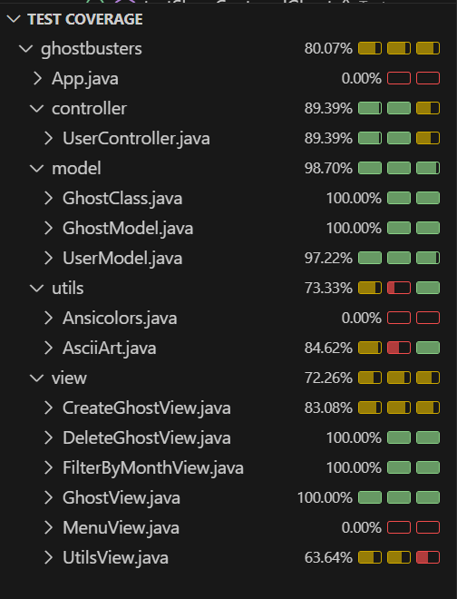

# Ghostbusters

### Captura y gestión de fantasmas

## Índice
1. [Descripción](#-descripción)
2. [Equipo de desarrollo](#-equipo-de-desarrollo)
3. [Tecnologías utilizadas](#-tecnologías-utilizadas)
4. [Funcionalidades principales](#-funcionalidades-principales)
5. [Alcance del MVP](#-alcance-del-mvp)
6. [Estructura del proyecto](#-estructura-del-proyecto)
7. [Instalación y ejecución](#-instalación-y-ejecución)
8. [Diagrama de clases](#-diagrama-de-clases)
9. [Cobertura de tests](#-cobertura-de-tests)

## Descripción
**Ghostbusters en Asturias** es una aplicación en Java que permite a los usuarios capturar, visualizar y gestionar fantasmas en diferentes ubicaciones de Asturias. Desarrollado con el patrón MVC y aplicando TDD, el proyecto se ejecuta en consola y cuenta con una cobertura mínima del 70% en pruebas.

## Equipo de desarrollo
🔹 **JavaNormal Activity** 👻
- [Celia](https://github.com/celiagarridoherrera)
- [Erika](https://github.com/erikamc99)

## Tecnologías utilizadas
-  **Lenguaje:** Java
-  **Patrón de diseño:** MVC
-  **Testing:** JUnit (mínimo 70% de cobertura)
-  **Testing:** Mockito
-  **Control de versiones:** Git y GitHub
-  **Herramientas adicionales:** Jira para la gestión de tareas

## Funcionalidades principales
1. **Capturar fantasmas**.
2. **Visualizar la lista de fantasmas atrapados**.
3. **Liberar fantasmas inofensivos**.
4. **Filtrar fantasmas** según su clase.
5. **Ver fantasmas capturados en un mes específico**.

## Alcance del MVP
El MVP incluye:
- Captura de fantasmas con asignación de atributos básicos (nombre, tipo, ubicación, peligrosidad).
- Listado y filtrado de fantasmas capturados.
- Funcionalidad de liberación de fantasmas inofensivos.
- Cobertura mínima del 70% en pruebas unitarias con JUnit y Mockito.
- Incluyendo únicamente los controladores y los modelos.

## Estructura del proyecto
```
📦 ghostbusters
 ┣ 📂 assets
 ┣ 📂 src
 ┃ ┣ 📂 main
 ┃ ┃ ┣ 📂 model
 ┃ ┃ ┣ 📂 view
 ┃ ┃ ┣ 📂 controller
 ┃ ┃ ┣ 📂 utils
 ┃ ┃ ┗ App.java
 ┃ ┣ 📂 test
 ┃ ┗ 📜 README.md
```

## Instalación y ejecución
1. Clonar este repositorio:
   ```bash
   git clone https://github.com/erikamc99/Ghostbusters.git
   ```
2. Abrir el proyecto en tu IDE de preferencia.
3. Compilar y ejecutar `App.java`.

### Diagrama de clases
[link al diagrama de clases](https://drive.google.com/file/d/1dANGnUUrBnzP-vaCv9GC9h70BTDaZCKD/view?usp=sharing)


### Cobertura de tests


---
¡Caza fantasmas y mantenos libre de espectros! 👻⚡
